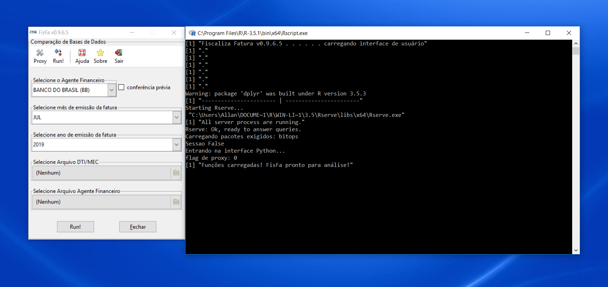
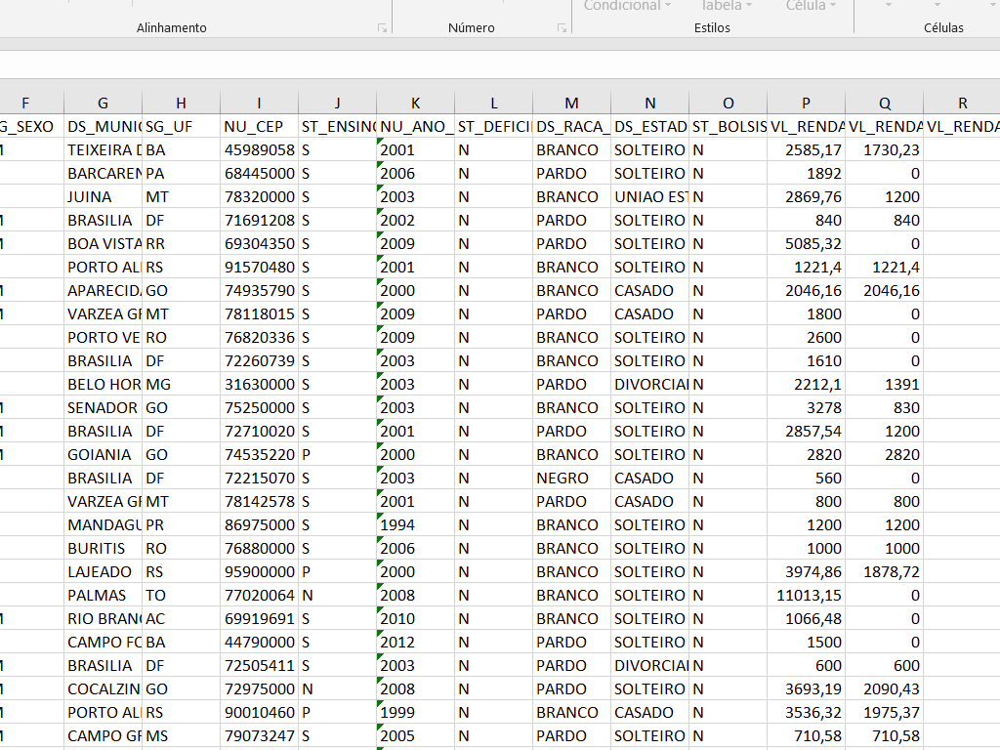
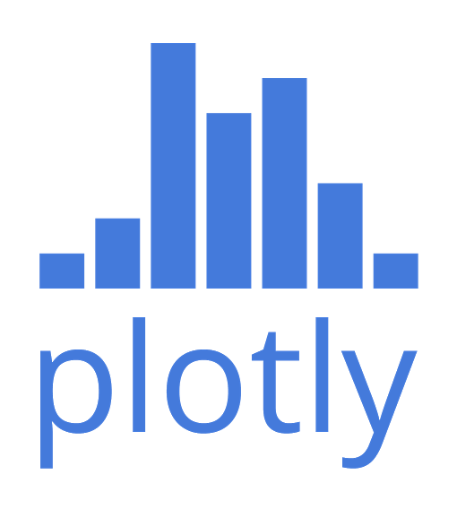

---
title       : Data Science
subtitle    : A importância da Ciência de Dados para o FNDE 
author      : Allan V. C. Quadros   -   Junho, 2019
job         : 
framework   : io2012        # {io2012, html5slides, shower, dzslides, ...}
highlighter : highlight.js  # {highlight.js, prettify, highlight}
hitheme     : tomorrow      # 
widgets     : [mathjax, quiz, bootstrap, interactive] # {mathjax, quiz, bootstrap}
ext_widgets : #{rCharts: [libraries/nvd3, libraries/leaflet, libraries/dygraphs]}
mode        : selfcontained # {standalone, draft}
knit        : slidify::knit2slides
logo        : fnde_blue.jpg
biglogo     : fnde_logo1.jpg
assets      : {assets: ../../assets}
--- .segue bg:grey

<style type="text/css">
body {background:grey transparent;
}
.quiz-option label{
  display: inline;
  font-size: 1em;
}
ul.nav li::before { content: ""; }  
ul.nav li{ font-size: 18px; line-height: 24px;}


em {
    font-style: italic
}
strong {
    font-weight: bold;
}

</style>

<br>

<br>
<br>
<br>

# *"In God we trust. All others must bring data."* 

<p style="text-align:right">W. Edwards Deming</p>


<!-- --- &twocol -->
<!-- ## Exemplos (do que não fazer) -->
<!-- <br> -->
<!-- *** =left -->
<!-- > -  -->

<!-- > -  -->


<!-- *** =right -->

<!-- > -  -->


--- .class #id
## Objetivo
<br>
<br>
<br>
> - **Mostrar a importância da Ciência de Dados para o FNDE**

--- .class #id
## Objetivos específicos

<br>
> - Definir o que é Data Science

<br>
> - Apresentar exemplos de sua aplicação no mundo contemporâneo

<br>
> - Apresentar exemplos de sua aplicação no FNDE

<br>
> - Indicar como adquirir esse tipo de conhecimento


--- .class #id
## O Que é Data Science?

> .fragment É um campo **multidisciplinar** que utiliza métodos científicos, processos, algoritmos e sistemas para extrair conhecimento e insights tanto de dados estruturados quanto não-estruturados.

<br>
> - dados `estruturados`? ..tabelas, banco de dados..

> - dados `não-estruturados`? ..páginas de internet, ex: redes sociais..

> - **algoritmos**? ..conjunto de rotinas.. $\rightarrow$ `programação` (1º passo - Módulos I e II)

<!-- > - **AI**? ..conjunto de técnicas/ algoritmos que podem ser aplicados para reconhecimento de imagens, de fala, chatbots, análise de sentimentos, classificação de objetos, etc.. (2º passo - Módulo III) -->


--- .class #id
## Data Science ... resumindo


Fonte: fusionanalytics.com


--- .class #id
## Para quê Data Science?
<br>
<br>
<br>
> - **RESOLVER PROBLEMAS!!**


--- .class #id
## 1º passo: programação

> - `Programação` = linguagem como qualquer outra

> - No caso, a que os computadores e máquinas entendem
<!-- # utilizar lógica e abstrações para que o computador entenda -->

> - Voluntário ?
<!-- # exemplo do robô humano.. para frente 10 passos -->


--- .class #id
## Por que programar?

> - Por que programar e não utilizar `apenas` Excel e outros aplicativos *point & click*?
<!-- # "apenas" pq nao precisaabondanar excel -->

> +   1) Maior controle sobre o que o programa faz -- ex: bug 17/15 dígitos Excel

> +   2) Maior segurança ao compartilhar e produzir informação -- ex: alterações erradas em tabelas/compartilhar código e não tabela

> +   3) Uma vez aprendida a linguagem, há economia de tempo -- ex: fácil mudar elementos

> +   4) Você pode fazer muito mais coisas -- ex: extração de dados da página do FNDE


--- .class #id
## Sessão "mão-na-roda"


--- &twocol
## Data Science é para todos!

*** =left

<br>
> - Estatísticos
<br>
> - Cientistas da Computação
<br>
> - Matemáticos
<br>
> - Engenheiros

*** =right

<br>
> - Administradores
<br>
> - Psicólogos
<br>
> - Médicos
<br>
> - Advogados
<br>
> - Pessoas comuns ...


--- &twocol
## Data Science no Mundo (1)

*** =left
<br>


*** =right
<br>


--- &twocol
## Data Science no Mundo (2)

Acidente com o AF447 (2009-2011)
*** =left

<br>


*** =right


--- &twocol
## Data Science no Mundo (3)

O caso Challenger (1986)
*** =left

<br>


*** =right

<br>


--- .class #id
## Data Science no Mundo (4)
<br>
<br>
> - sistemas de recomendação;

> - reconhecimento facial (desde aplicação policial até diversão no celular: snapchat);

> - detecção de doenças;

> - detecção de exoplanetas;

> - detecção de fraudes (cartão de crédito);


--- .class #id
## Data Science no setor público

`pioneiros:`

- CGU, Receita, BB

`soluções:`

- Detecção de fraudes, estimativa de espera em fila, raspagem diário oficial, detecção de lavagem de dinheiro em exportações


<!-- # --- &twocol
<!-- # ## Data Science no Mundo -->

<!-- # - video google duplex talvez -->

--- .segue bg:grey
# E no FNDE?


--- .segue bg:grey
# Como o FNDE lida com o grande volume de dados de seus programas?


--- .segue bg:grey


--- .segue bg:grey


--- .segue bg:grey
 </br>

--- .segue bg:grey


--- .segue bg:grey
# Você saberia dizer quanto e o quê o programa com o qual você trabalha retorna para a sociedade?


--- .class #id
## Algumas iniciativas isoladas

<br>
> - Malha-Fina FNDE
<br>
> - FisFa - Fiscaliza Fatura FIES
<br>
> - Conferência da carteira de títulos do FIES
<br>
> - Projeções financeiras de arrecadação
<br>
> - App para controle orçamentário de emendas parlamentares na DIFIN
<br>
> - Robô para raspagem do Diário Oficial da União
<br>
> - Capacitação de servidores em Análise de Dados
<br>
- Outras ...

> - Nem tudo foi nem será aproveitado, mas o importante é ter a `liberdade` de tentar/buscar `soluções para os problemas`.


--- &twocol
## FisFa - Fiscaliza Fatura FIES

*** =left

> - aplicativo para fiscalização das faturas dos AF do Fies

> - mensalmente: taxa de administração da carteira de financiamento

> - fatura + base de dados dos alunos (+ 1,7 milhão linhas cada)

> - valor anual total das faturas ultrapassa R$800 milhões/ano

> - antes: conferência pro-forma ("amostragem") sem base de referência MEC


*** =right

> - indagações constantes de TCU/CGU

> - Projeto FisFa estruturou base de dados do MEC

> - tempo de análise: de 2 semanas para < 1 minuto

> - confiabilidade/robustez

> - total de economia: > R$ 200 milhões

> - Programado em `R` internalizando as regras contratuais

> - 2 prêmios: CGU (2016) e ANGC (2018)


--- .class #id
## FisFa - Fiscaliza Fatura FIES



--- &twocol
## Malha Fina FNDE

*** =left

> - entram 35 mil prestações de contas (PC)

> - capacidade de análise: ~ 3,5 mil/ano*

> - `permitirá`:
  
  > + $\space$ eliminar passivo de mais de 290 mil PC (em 5 anos*)
  
  > + $\space$ economia de mais de R$ 3 bilhões 
  
  > + $\space$ economia de mais de meio século de trabalho
  
> - **taxa de acerto: 90%**  


*** =right

- 


--- .class #id
## Aplicação no FNDE

  Como resolver?

- 


--- .class #id
## Tentativa 1

- 


--- .class #id
## Tentativa 2


```{r, echo=FALSE, warning=FALSE, cache=FALSE, results='asis'}
cat('<iframe src="./assets/widgets/plotly_scatter1.html" width="90%" height="50%" scrolling="no" seamless="seamless" frameBorder="1"> </iframe>')
```


--- .class #id
## Solução

- Utilizar um modelo de classificação (regressão logística)

- 

<br>

> - Detectou inadimplentes em ~ $\frac{3}{4}$ das vezes


--- .class #id
## Desafios a serem atacados ainda

- automação de tarefas -- ex: consultar Documenta, protocolo, fiscalização contratos

<br>

- visualização/gerenciamento de dados -- ex: DIFIN/FNDE

<br>

- estimativas -- ex: PNLD, PAR, DIFIN

<br>

- otimização -- ex: FUNDEB

<br>

- monitoramento e avaliação -- ex: AUDIT/DIGAP/DIRAE


--- .class #id
## Onde obter conhecimento?

<br>
<br>
> - Trilha de capacitação em Data Science do FNDE;
<br>
<br>
> - Internet: MOOCs: Coursera, Udemy, Udacity; Youtube, Khan Academy, Blogs, etc


--- .segue bg:grey
<br>
<br>
# Obrigado!!

<!-- como colocar figuras ao lado de palavras varias vezes em html -->
<div>
    <p>Feito no
     com 
     e
     !! </p>
</div>

Apresentação disponível noem:
<br>

<p>
<a href="https://allanvc.github.io/talk_DS_FNDE/" style="color:black">allanvc.github.io/talk_DS_FNDE/</a>
</p>

<br>

*Contato:*

*Allan V. C. Quadros*

<p>
<a href="mailto:allan.quadros@fnde.gov.br" style="color:black">allan.quadros@fnde.gov.br</a>
</p>
<p>
<a href="https://allanvc.github.io" style="color:black">allanvc.github.io</a>
</p>
