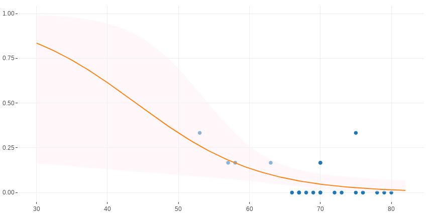

---
title       : Data Science
subtitle    : A importância da Ciência de Dados para o FNDE 
author      : Allan V. C. Quadros
job         : 
framework   : io2012        # {io2012, html5slides, shower, dzslides, ...}
highlighter : highlight.js  # {highlight.js, prettify, highlight}
hitheme     : tomorrow      # 
widgets     : [mathjax, quiz, bootstrap, interactive] # {mathjax, quiz, bootstrap}
ext_widgets : #{rCharts: [libraries/nvd3, libraries/leaflet, libraries/dygraphs]}
mode        : selfcontained # {standalone, draft}
knit        : slidify::knit2slides
logo        : fnde_blue.jpg
biglogo     : fnde_logo1.jpg
assets      : {assets: ../../assets}
--- .segue bg:grey

 
 
 
 
 
 
 

# *"In God we trust. All others must bring data."* 

W. Edwards Deming

<!-- --- &twocol -->
<!-- ## Exemplos (do que não fazer) -->
<!--   -->
<!-- *** =left -->
<!-- > -  -->

<!-- > -  -->

<!-- *** =right -->

<!-- > -  -->

--- .class #id
## Objetivo
 
 
 
> - Mostrar a importância da Ciência de Dados no mundo atual e no FNDE

--- .class #id
## Objetivos específicos
 
 
> - Definir o que é Data Science

 

> - Trazer exemplos de sua aplicação no mundo contemporâneo

 

> - Trazer exemplos de sua aplicação no FNDE

 

> - Indicar como adquirir esse tipo de conhecimento

--- .class #id
## O Que é Data Science?
 
> .fragment É um campo **multidisciplinar** que utiliza métodos científicos, processos, algoritmos e sistemas para extrair conhecimento e insights tanto de dados estruturados quanto não estruturados.

 
 
> - dados não estruturados - ex: Twitter: o que as pessoas estão falando do FNDE no twitter?)

> - dados estruturados: alguém consegue tirar alguma informação só de olhar para uma tabela de > 500 mil linhas?

--- &twocol
## Quem está fazendo Data Science?

*** =left

 
> - Estatísticos
 
> - Cientistas da Computação
 
> - Matemáticos
 
> - Engenheiros

*** =right

 
> - Administradores
 
> - Psicólogos
 
> - Médicos
 
> - Advogados
 
> - Pessoas comuns

--- &twocol
## Data Science no Mundo

*** =left

*** =right

--- .class #id
## Data Science no Mundo

> - sistemas de recomendação;

> - reconhecimento facial (desde aplicação policial até diversão no celular: snapchat);

> - classificação de doenças;

> - detecção de fraudes (cartão de crédito);

--- .segue bg:grey
# E no FNDE?

--- .segue bg:grey
# Como o FNDE lida com o grande volume de dados de seus programas?

--- .segue bg:grey

--- .segue bg:grey

--- .segue bg:grey
  

--- .segue bg:grey

--- .segue bg:grey
# Você saberia dizer quanto e o quê o programa com o qual você trabalha retorna para a sociedade?

--- .class #id
## Aplicação no FNDE

  Como resolver?

- 

--- .class #id
## Tentativa 1

- 

--- .class #id
## Tentativa 2

<iframe src="./assets/widgets/plotly_scatter1.html" width="90%" height="50%" scrolling="no" seamless="seamless" frameBorder="1"> </iframe>

--- .class #id
## Solução

- Utilizar um modelo de classificação (regressão logística)

- 

 

> - Detectou inadimplentes em ~ $\frac{3}{4}$ das vezes

--- .class #id
## Onde obter conhecimento?

 
 
> - Trilha de capacitação em Data Science do FNDE;
 
 
> - Internet: Coursera, Udemy, Udacity, Youtube, Khan Academy, Blogs

--- .segue bg:grey
 
 
# Obrigado!!

<!-- como colocar figuras ao lado de palavras varias vezes em html -->

    
Feito no
     com 
     e
     !! 

Apresentação disponíveis noem:
 

<a href="https://allanvc.github.io/slide_DS_FNDE/" style="color:black">allanvc.github.io/slide_DS_FNDE/</a>

 

*Contato:*

*Allan Vieira de Castro Quadros*

<a href="mailto:allan.quadros@fnde.gov.br" style="color:black">allan.quadros@fnde.gov.br</a>

<a href="https://allanvc.github.io" style="color:black">allanvc.github.io</a>

